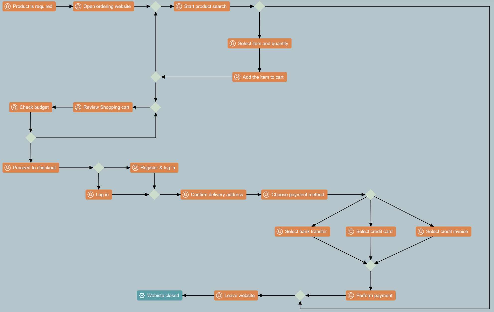
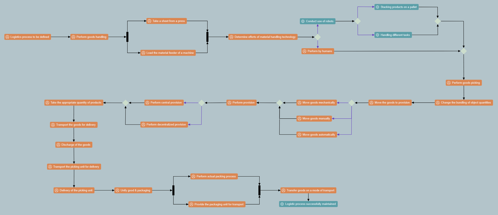
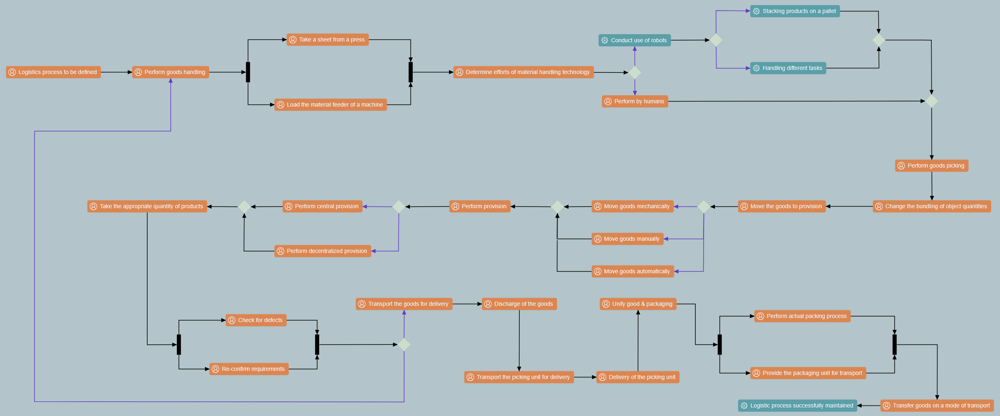
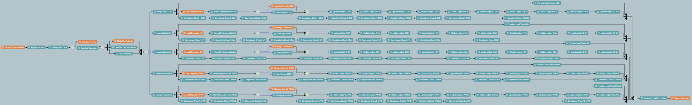

# MCP4GLSP Evaluation Tasks

This repository provides the underlying data for the evaluation for the papaer "Realizing a Model Context Protocol Server for the Graphical
Language Server Platform".

Each directory contains the files used as prompt input for Claude Sonnet 4.6 via Claude Code. Those files naturally contain the task descriptions.

The gathered experimental data is collected and processed in [data.xlsx](data.xlsx).

## Task 1 - Offer

1. An offer is required to be done by the sales department of a specific company. At this point, the commercial manager has to perform a feasibility check based on the business requirements & needs to ensure that the offer is feasible.
2. If the offer is not feasible, the customer has to be informed and at this point the process ends after informing him.
3. If the offer is feasible, the personnel needs & availability has to be checked. After clarifying the availability based on the business resources, the offer has to be created by the commercial employee and the process ends at creating the offer.

## Task 2 - Placing an order

1. Upon realizing that a product is required by the purchasing department, the ordering website (Firefox) has to be opened.
2. In the next step, the product search has to be defined and though defining the product characteristics \& specifications based on the business requirements \& needs.
3. If the search for the specific product was not successful, the website has to be left and the process ends at closing the website.
4. In case the search was successful, the item and the quantity have to be selected and the item has to be added to the shopping cart.
5. Afterwards, if more items have to be added, then the product search process has to be performed again (Loop). If on the other hand, no more items have to be added, the purchaser has to review the shopping cart and check his budget. In case insufficient budget is found, the shopping cart has to be reviewed again. If, on the other hand, sufficient budget is found, he proceeds to checkout. In this stage, either he is already registered in the website and a log in is required or he has to register \& log in to the website. After doing this, the delivery address has to be confirmed.
6. The purchaser has then to choose the payment method, which can be bank transfer, credit card payment or credit invoice.
7. After deciding on the payment method, the payment has to be performed.
8. Finally, after confirming the payment, the purchaser leaves the website together with the case search not successful and the process ends at website closed.

## Task 3 - Logistic Process

1. Logistic process needs to be defined by the logistics department. First, the goods handling process has to be performed by the Handler based on the Handling Order received.
2. In order to perform the goods handling, either a sheet has to be taken from a press or the material feeder has to be loaded to the machine. After doing the task given, efforts of material handling technology has to be determined. If handling the materials have considerable effort, the usage of robots can to be conducted. However, robots need costly image processing systems in order to perform their tasks, which can be mitigated if the process is performed by humans. Furthermore, if the required task is to stack products on a pallet, stationary robots have to be used. If on the other hand, the task is to perform different things (movabl5., mobile robots has to be used. In case the material handling has not a considerable effort, the handling task has to be performed by humans. A risk may occur in this step, in that wrong assessment may be determined in considering the material handling efforts.
3. Both options are united again to perform goods picking (Service) process by the Picker (based on the picking order & material and goods stock). First, the bundling of object quantities have to be changed (picking order).
4. In performing this step, a series of activities have to be performed: First the goods have to be moved for provision. In doing so, goods can be moved mechanically, manually or automatically. Then, provision has to be performed. In this step provision can be performed on central or decentralized way. In choosing central provision goods are brought to a picking place (following “Commodity to the person” principle). The appropriate quantity of products has then to be taken out (based on the degree of automation decision) by the picker. In choosing decentralized provision, goods are to be picked by the picker himself (following “Person to the Commodity” principle). Many risks may occur in this step, which are wrong assessment, wrong product & product quantity and broken load units. After that, the goods has to be transported to a transport container for delivery, the goods have to be discharged, the picking unit has to be transported for delivery and finally the picking unit has to be delivered.
5. After performing all picking processes, the packaging (Service) process starts in that goods & packaging has to be unified by the Logistic assistant (based on the packaging order). Packaging protection function has to be set as a control in this step to mitigate mechanical & climatic loads and theft occurring in this activity.
6. After performing this step, actual packaging process & providing the packaging for transport are to be done at the same time. In this both options, a high disposal logistical effort may occur. In order to mitigate this risk, reusable packaging has to be used in this performance.
7. Both options are united again to transit & transport (Service) goods process by the Warehouse assistant using the Transport Order received.

## Task 3.5 - Model Modification

(Working with the expected outcome of Task 3.)

After a quantity of goods has been taken during provisioning, they need to simultaneously be checked for defects and the requirements have to be re-confirmed. Afterwards, if any issues occur, then the process starts over again at goods handling, otherwise it continues as before.

## Task 4 - Limit testing

### Task: Global Logistics Routing Model

**Objective:** Map the standard operating procedure for a global logistics routing system.
**Rules for the Modeler:** \* Use exactly the element types provided.

- Labeling is strict. If a task name is provided in quotes (e.g., "Verify Order"), it must be applied to the `label` property of an Automated or Manual Task.
- Gateways (Join, Fork, Merge, Decision) do not take labels. Reference them by their structural position.
- Standard `Edge` elements are used for all connections unless `Weighted Edge` is explicitly requested.

---

#### Phase 1: Intake and Triage (11 Nodes)

1.  **Start:** Create a `Manual Task` labeled "Receive Cargo Manifest".
2.  Connect it via an `Edge` to an `Automated Task` labeled "Digitize Manifest".
3.  Connect to an `Automated Task` labeled "Sanity Check Data".
4.  Connect to a `Decision Node`.
5.  From the `Decision Node`, create two outgoing `Weighted Edges`:
    - **Weight 80%:** Connects to an `Automated Task` labeled "Standard Clearance".
    - **Weight 20%:** Connects to a `Manual Task` labeled "Exception Review".
6.  Connect both "Standard Clearance" and "Exception Review" via standard `Edges` to a single `Merge Node`.
7.  Connect the `Merge Node` to a `Fork Node`.
8.  From the `Fork Node`, create three parallel branches using standard `Edges`:
    - **Branch 1:** `Automated Task` labeled "Log Initial Entry".
    - **Branch 2:** `Automated Task` labeled "Calculate Estimated Tariffs".
    - **Branch 3:** `Manual Task` labeled "Notify Port Authority".
9.  Connect the outputs of Branches 1, 2, and 3 to a single `Join Node`.

#### Phase 2: Global Region Distribution (160 Nodes)

_The flow now splits into 5 identical processing regions (North America, South America, EMEA, APAC, and Oceani1.. Read the following pattern carefully._

1.  Connect the `Join Node` from Phase 1 to a `Decision Node`.
2.  Create 5 outgoing `Weighted Edges` from this `Decision Node`, each with a **20% weight**.
3.  Each of these 5 edges initiates a **Regional Sub-Process**. You must build this exact 31-node structure **five separate times**, appending the region identifier (NA, SA, EMEA, APAC, OCE) to the labels in each cluster.

**The Regional Sub-Process Pattern (Build 5 Times):**

- **Node 1:** `Automated Task` labeled "Assign Route [Region]" (e.g., "Assign Route NA").
- **Node 2:** Connect Node 1 to a `Fork Node`.
- **Branch A (The Sequential Branch - 10 Nodes):**
  - From the `Fork Node`, create a sequence of 10 `Automated Tasks`. Label them sequentially: "Compliance Check 1 [Region]" through "Compliance Check 10 [Region]". Connect them end-to-end with standard `Edges`.
- **Branch B (The Audit Branch - 17 Nodes):**
  - From the `Fork Node`, connect to a `Manual Task` labeled "Load Inspection [Region]".
  - Connect to an `Automated Task` labeled "Submit Inspection Data [Region]".
  - Connect to a `Decision Node`.
    - `Weighted Edge` (95%) -> `Automated Task` labeled "Auto-Approve [Region]".
    - `Weighted Edge` (5%) -> `Manual Task` labeled "Manager Override [Region]".
  - Connect both approval tasks to a `Merge Node`.
  - Connect the `Merge Node` to a sequence of 10 `Automated Tasks`, labeled "Update Ledger 1 [Region]" through "Update Ledger 10 [Region]".
- **Branch C (The Fast Track - 1 Node):**
  - From the `Fork Node`, connect to a single `Automated Task` labeled "Pre-clear Local Transit [Region]".
- **Sub-Process Conclusion (Node 31):**
  - Connect the final task of Branch A ("Compliance Check 10"), the final task of Branch B ("Update Ledger 10"), and the single task of Branch C ("Pre-clear") to a single `Join Node`.

#### Phase 3: Final Consolidation (3 Nodes)

1.  You should now have 5 separate `Join Nodes` ending your 5 regional flows.
2.  Connect all 5 `Join Nodes` via standard `Edges` into a single, global `Merge Node`.
3.  Connect the global `Merge Node` to an `Automated Task` labeled "Generate Final Bill of Lading".
4.  Connect that to the final `Manual Task` labeled "Dispatch Transport".
